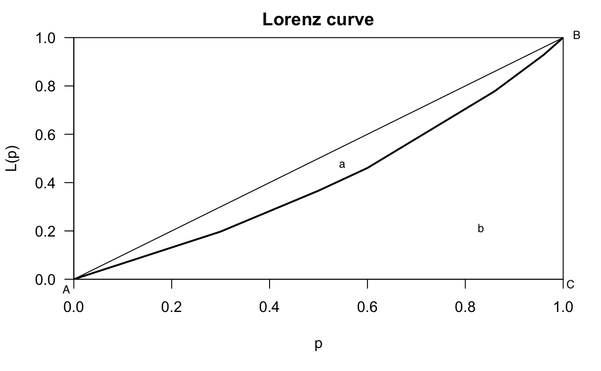

---
output:
  pdf_document: default
  html_document: default
---
# Medidas de desigualdade

O assunto sobre medidas de desigualdade está baseada na sua totalidade no capítulo 17 de @Hoffmann2016

## Príncipio de Pigou-Dalton

A condição de Pigou-Dalton define que as medidas de desigualdades devem ter seus valores aumentados quando há transferência regressivas de renda.
Para entender a condicção de Pigou-Dalton, considere uma população com apenas duas pessoas cujas rendas são $X_1$ e $X_2$. Então, $\mu = \frac{X_1 + X_2}{2}$. No caso de perfeita igualdade, $X_1 = X_2 = \mu$. No caso de uma distribuição com $X_1 \neq X_2$, uma transferência de renda do mais pobre para o mais rico, mantendo a renda média constante, aumenta o grau de desigualdade.

## Transferência Regressiva

Essa tranferência de renda do mais pobre para o mais rico, mantida a renda média constante, é denominada como **transferência regressiva** de renda. Portanto, uma **transferência progressiva** é a transferência de renda do mais rico para o mais pobre.


## Curva de Lorenz

Table: (\#tab:pessoasocupadas) Distribuição de pessoas ocupadas conforme renda obtida na atividade exercida no Brasil, de acordo com a PNAD 2003 

-------------------------------------------------------------------------
            % no estrato    % no estrato   % acumulada    % acumulada     
  estrato   da população      da renda     da população   da renda        
                 (%)             (%)         (100$p$)     (100$\Phi$)     
--------- ---------------- -------------- -------------- ---------------- 
      I         30                7             30                 7       

     II         20                9             50                16       

    III         20               13             70                29       

     IV         10               10             80                39       

      V         10               16             90                55       

     VI          5               13             95                68       

    VII          4               19             99                87       

   VIII          1               13            100               100       
-------------------------------------------------------------------------

Considere os dados da tabela \@ref(tab:pessoasocupadas). Na coluna de porcentagem acumulada podemos observar que 70% da população possui 29% da renda. Os percentuais acumlados da população $p$ e da renda $\Phi$ formam um plano cartesinao $(p,\Phi)$ originando a Cuirva de Lorenz. 


```{r CurvaLorenzR, echo=TRUE, fig.cap="Curva de Lorenz"}
library(ineq)
# usando os valores do exemplo em porcentagem mesmo
p <- c(30,20,20,10,10,5,4,1)
r <- c(7,9,13,10,16,13,19,13)

# calcula o mínimo da curva de Lorenz
Lc.min <- Lc(r, n = p)
# Desenha a curva de Lorenz em um gráfico
plot(Lc.min)
```
Considerando a curva de Lorenz, figura \@ref(fig:CurvaLorenz), que é basicamente a obtida pelo R, figura \@ref(fig:CurvaLorenzR), mas com algumas indicações, é possível obter algumas definições.

```{r CurvaLorenz, fig.align = 'center', out.width = '100%', fig.cap = "A curva de Lorenz com algumas indicações"}


```

A área que corresponde a letra $a$ é denominada área de desigualdade. o seguimento de retas $\overline{AB}$ é chamado de *linha de perfeita igualdade* onde $p=\Phi$ e a área de de desigualdade é zero.

Analisando o casos de máxima desigualdade:

- excluindo-se o fato de renda negativa, considere que apenas um de $n$ indíviduos receba toda a renda e os demais $n-1$ indivíduos recebam zero de renda.
- Neste caso a pocentagem de renda é zero até o ponto $\dfrac{n-1}{n}$ no eixo horizontal, tornando-se $\Phi = 1$ ao se incluir o último indíviduo.
- Neste caso, a Curva de Lorenz é dada pela poligonal $\widehat{ABC}$ e a área de desigualdade máxima é o triângulo $ABC$.

## Discrepância Máxima

Discrepância Máxima é a maior distância entre entre a linha AB e a curva de Lorenz da figura \@ref(fig:CurvaLorenz). Portanto, a discrepância máxima é a diferença máxima entre a relação da porcentagem acumulada da população e a sua respectiva porcentagem acumulada da renda numa situação de exata igualdade dada pela reta AB e a relação da porcentagem acumulada da população e a sua respectiva porcentagem acumulada da renda numa situação de desigualdade entre as pessoas dessa população.

## Índice Gini

Considere os dados da tabela \@ref(tab:pessoasocupadas). Seja $p$ o valor da proporção acumulada da população até certo estrato e seja $\Phi$ o valor da correspondente proporção acumulada da renda. Os pares de valores $(p,\Phi)$, para os diversos estratos, definem pontos em um sistema de eixos cartesianos como aparece na figura \@ref(fig:CurvaLorenz). Estes pontos estão sobre a curva de Lonrez, que mostra como a porporção acumulada da renda $(\Phi)$ varia em função da proporção acumulada da população $(p)$, com as pessoas ordenadas de acordo com valores crescentes da renda. A área correspondente a $a$ que está entre a reta AB e a curva de Lorenz na figura \@ref(fig:CurvaLorenz), é denominada **área de desigualdade**.

Para entender como ocorre a variação desta área de desigualdade, a área $a$, primeiro considere uma situação de distribuição de renda com perfeita igualdade, ou seja, uma população em que todos recebem a mesma renda.Nesta situação, a uma população $p$ da população corresponde uma igual proporção $\Phi$ da renda total, ou seja, $\Phi = p$. Portanto, a curva de Lorenz dessa distribuição coincide com a reta AB da figura \@ref(fig:CurvaLorenz), denominado, por isso, de **linha de perfeita igualdade**. Neste caso a área de desigualdade é igual a zero.

Considere agora uma outra situação, uma distribuição de renda com o máximo de desigualdade. Considerando que **não** existe a possibilidade de renda negativa, esse seria o caso de uma população com $n$ pessoas, em que uma delas recebe toda a renda e as $n-1$ restante receba zero de renda. Nesta situação, a proporção acumulada da renda é igual a zero até o ponto do eixo horizontal (abcissa) $\frac{(n-1)}{n}$, tornando-se $\Phi = 1$ quando se se inclui a pessoa que recebe toda a renda. Neste caso, a curva de Lorenz passa a ser a poligonal ABC da figura \@ref(fig:CurvaLorenz). Que é numericamente igual a 0,5 (Por quê?).

Por definição, o **índice de Gini (G)** é uma relação entre a área de desigualdade, indicada por $a$ que aqui passaremos a denominar de $\alpha$, e a área do triângulo ABC que é numericamente igual a 0,5, ou seja,

\[
G = \dfrac{\alpha}{0,5} = 2\alpha
(\#eq:Gini)
\]

A fórmula \@ref(eq:Gini) é uma das fórmulas de Gini que tem utilidade do ponto de vista teórico.

## Redundância

## Índice de Theil

### Índice T de Theil

### Índice de L de Theil

## Variância dos Logaritmos


